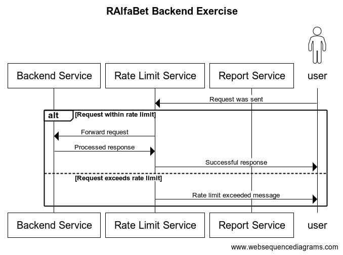

# RAlfaBet Backend Exercise

<!-- TOC -->
* [RAlfaBet Backend Exercise](#ralfabet-backend-exercise)
  * [The API documentation](#the-api-documentation)
  * [Entities](#entities)
    * [Event](#event)
    * [User](#user)
    * [Venue](#venue)
  * [EndPoints](#endpoints)
    * [Controllers](#controllers)
      * [Event](#event-1)
      * [UserController](#usercontroller)
      * [VenueController](#venuecontroller)
      * [NotificationController (bonus)](#notificationcontroller-bonus)
      * [WS (bonus)](#ws-bonus)
    * [RateLimit (bonus)](#ratelimit-bonus)
    * [Redis](#redis)
    * [Database (Relational)](#database-relational)
  * [BLs](#bls)
    * [EventsBL](#eventsbl)
    * [ReportServiceSubscriptionBL](#reportservicesubscriptionbl)
  * [Test Plan](#test-plan)
    * [UT (for BLs)](#ut-for-bls)
    * [Integrations](#integrations)
<!-- TOC -->

## The API documentation
To access the documentation run the app and go to [host/swagger](http://localhost:5000/swagger) for the full api documentation

## Entities

### Event

1. Title
2. Date (Time)
3. Organizer(owner)
4. Guests (User, is Subscribed)
5. Places:
    1. Location
    2. Venue
    3. Link
6. Notifications: default is 30 min
7. Description
8. Created at

### User

1. Username
2. Role

    1. Admin
    2. member

### Venue

1. Room name
2. Notes

## EndPoints

### Controllers

#### Event

1. Create a new Event.
2. Retrieve all.
3. Retrieve one (specific event).
4. Update one (specific event).
5. Delete one (specific event).
6. V2?

    1. Retrieve based on location.
    2. Retrieve based on venue.
    3. Retrieve sorted by date.
    4. Retrieve sorted by the number of guests.
    5. Retrieve sorted by created date.
7. V3 (Bonus):
    1. Batch CRUD operations.

#### UserController

1. CRUD…

#### VenueController

1. CRUD…

#### NotificationController (bonus)

1. Register
    1. Get event by ID.
    2. Get user by ID.
    3. Validate user is in the guests.
    4. Update user subscription to true.

#### WS (bonus)

1. Enable SSE for subscribers for relevant events.

### RateLimit (bonus)

Manage rate limit: allow x requests in y frequency time (e.g. 100 r in 1 m).

### Redis

1. to allow more than one pod.
2. To prevent incrementation  and setting to 0 at the same time (relational DB downside).

### Database (Relational)

1. Choose between Postgres/Maria/Sqlite.

## BLs

### EventsBL

1. UpdateOne
    1. Trigger RabbitMQ flow.
    2. Publish in MQ.

### ReportServiceSubscriptionBL

1. Sub to update event topic.
2. Listen to RabbitMQ.
3. Notify the user reminders (e.g., console log).
4. Offer real-time notifications to instantly notify subscribers of event changes (bonus).

## Test Plan

### UT (for BLs)

1. Retrieve one:
    1. Test retrieving a specific event by its ID.
    2. Test behavior when the requested event ID does not exist.
    3. Test response structure for a valid request.

2. Retrieve all
    1. Test retrieving an empty list when no events are present.
    2. Test retrieving a list with multiple events.
    3. Test the response format and structure.

3. Create a new Event
    1. Test the successful creation of an event.
    2. Test creation with invalid or incomplete data.
    3. Test handling of duplicate event entries.

4. Update one (specific event)
    1. Test updating an event successfully.
    2. Test updating with invalid data.
    3. Test attempting to update a non-existent event.
5. Delete one (specific event)

    1. Test successful deletion of an event.
    2. Test attempting to delete a non-existent event.
    3. Test the state of the system after deletion.
6. Retrieve based on locations.

    1. Test retrieving events for a specific location.
    2. Test with no events available at a given location
7. Retrieve based on venue

    1. Test retrieving events for a specific venue.
    2. Test with no events at the specified venue.
8. Retrieve sorted by date.

    1. Test retrieving events ordered by date.
    2. Test with multiple events on the same date.
9. Retrieve sorted by number of guests.

    1. Test sorting events based on guest numbers.
    2. Test with events having the same number of guests.
10. Retrieve sorted by create date.

     1. Test sorting events by their creation date.
     2. Test with multiple events created on the same date.
11. Batch CRUD operations (Bonus)

     1. Test batch creation of multiple events.
     2. Test batch update and deletion of events.
     3. Test partial success/failure scenarios (e.g., some operations succeed while others fail).

### Integrations

| **Given**                         | **When**                                             | **Then**                                                                         |
|:----------------------------------|:-----------------------------------------------------|:---------------------------------------------------------------------------------|
| DB Has UnSorted events            | Trying To fetch a sorted                             | The fetched data is sorted                                                       |
| A user with admin privileges      | The user creates a new event with valid data.        | The event is successfully created in the database and a confirmation is returned |
| A user without admin privileges   | The user creates a new event with valid data.        | The event isn’t created and 401 response is sent                                 |
| An existing event in the database | A user updates the event details (like Date, Venue). | The event details are updated in the database and a confirmation is returned.    |

